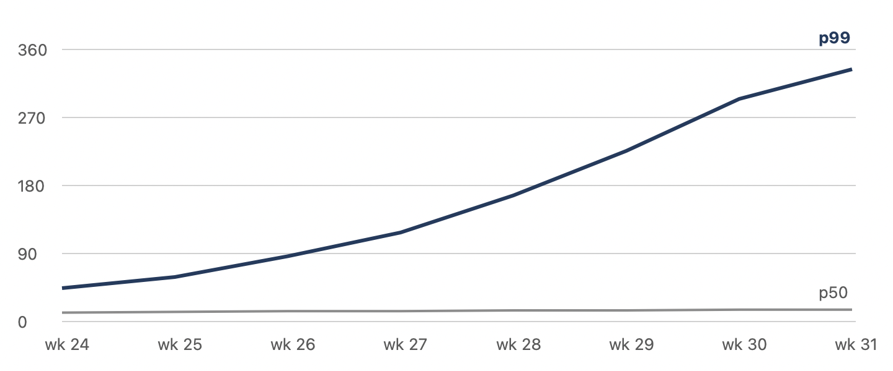

# Ledger Write Path Review

## Summary

The ledger's write path carries every payment the company settles, and in the last quarter its **p99 commit latency rose from 45 ms to 340 ms** under Friday load. This review traces that to one shared Postgres primary and a retry policy that amplifies it, and recommends three changes — two of them cheap.

Nothing here is speculative: every number comes from the `ledger-metrics` dashboard for the eight weeks to 8 August, and the reproduction in [the load-test repository](https://github.com/example/ledger-loadtest) runs in under ten minutes.

## What we found

### The shared primary

Forty services write to one primary. That was fine at 20 deploys a day; it is not fine at 200, because each deploy's connection churn lands on the same box. The symptom is *not* CPU — it is lock contention on `ledger_entries`, visible as `LWLock:BufferContent` waits.

| Week | p50 (ms) | p99 (ms) | Retries / min | Incidents |
|------|---------:|---------:|--------------:|----------:|
| 24   | 12       | 45       | 3             | 0         |
| 26   | 14       | 88       | 11            | 0         |
| 28   | 15       | 170      | 41            | 1         |
| 30   | 16       | 340      | 129           | 2         |

The retry column is the one to watch. Retries are *caused by* latency and then *cause* more of it — a classic amplification loop.

### The retry policy

The client retries a timed-out commit immediately, up to five times. Under contention that turns one slow commit into six:

```swift
func commit(_ entry: Entry) async throws {
    for attempt in 0..<5 {
        do { return try await primary.commit(entry) }
        catch is TimeoutError { continue }   // no backoff, no jitter
    }
    throw CommitError.exhausted
}
```

A commit that is *already* in flight is not cancelled by the timeout, so the retried commit queues behind it. The fix is well known: exponential backoff with jitter, and — more importantly — an idempotency key so a retry cannot double-post.

> The ledger is the one system where "at least once" is worse than "at most once". A duplicated entry costs more to unwind than a delayed one costs to wait for.
>
> — Post-incident review, 2 July

## Recommendations

1. **Add backoff and jitter to the commit client.** One afternoon. Removes the amplification loop; expected to bring p99 under 120 ms on its own.
2. **Introduce idempotency keys on `ledger_entries`.** One week, including the migration. Makes retries safe and lets us raise the retry budget later.
3. **Split the primary by tenant shard.** One quarter. The only change that addresses the underlying limit rather than the symptom.

The first two should ship before the next Friday peak. The third needs a design review, and this document is the input to it.

### Work already done

- [x] Dashboard for lock waits (`ledger-metrics` → *Contention*)
- [x] Load-test reproduction at 3× Friday peak
- [ ] Backoff patch reviewed
- [ ] Migration plan for idempotency keys
  - [ ] Backfill strategy for the 41 M existing rows
  - [ ] Cut-over rehearsal on the staging replica

---

## Appendix: measurement method

Latency is measured at the client, from `commit()` call to acknowledgement, so it includes queueing. Percentiles are computed per minute and then aggregated with the ~~mean~~ **median of the per-minute values**, which understates short spikes; the raw per-minute series is in the dashboard for anyone who wants the ugly version.



Questions to `#ledger-reliability`, or to me directly at alex@moreau.dev.
